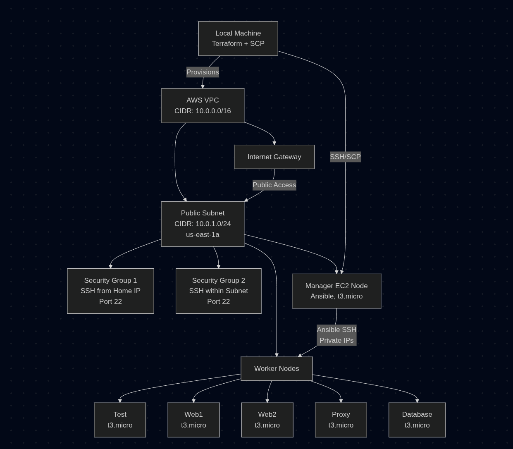
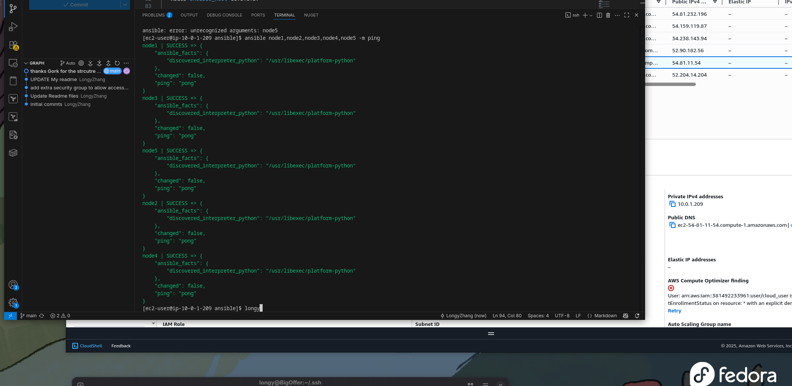

# Terraform & Ansible EC2 Deployment

## 📝 Overview
This project uses **Terraform** to provision AWS infrastructure (VPC, subnet, security groups, and EC2 instances) and **Ansible** to configure and manage the EC2 instances. The setup includes one manager node to control multiple worker nodes, all deployed in a public subnet with SSH access configured for secure communication.

## 📁 Project Structure
```
terraform-ec2-redhat/
├── main.tf           # Main Terraform configuration
├── outputs.tf        # Outputs like instance IPs
├── variables.tf      # (Optional) variables file
├── ansible/          # Ansible configuration directory
│   ├── ansible.cfg   # Ansible configuration file
│   └── hosts         # Ansible inventory file
├── README.md         # This file
```

## 🔧 Infrastructure Setup (Terraform) and Architecture



1. **VPC and Subnet**:
   - A single VPC with one **public subnet** is provisioned.
   - All EC2 instances (1 manager node + 6 worker nodes) reside in this subnet.

2. **Security Groups**:
   - **SG1**: Allows SSH (port 22) from your home IP address.
   - **SG2**: Allows SSH (port 22) from within the subnet for VPC node communication.

3. **EC2 Instances**:
   - Instances are provisioned with a specified AWS key pair for SSH access.
   - The manager node uses Ansible to control worker nodes.

4. **Terraform Files**:
   - `main.tf`: Defines VPC, subnet, security groups, and EC2 instances.
   - `outputs.tf`: Outputs instance IPs (e.g., public and private IPs).
   - `variables.tf`: (Optional) Defines reusable variables.

### Usage
1. Initialize Terraform: `terraform init`
2. Apply the configuration: `terraform apply`
3. Retrieve instance IPs from `outputs.tf` for Ansible configuration.

## ⚙️ Ansible Manager Node Configuration

After provisioning, configure the **manager EC2 node** to control worker nodes using Ansible.

### 1. Install Dependencies
SSH into the manager node and run:
```bash
sudo yum install -y python3
pip3 install --user ansible
```

### 2. Verify Ansible Installation
Check the Ansible version:
```bash
~/.local/bin/ansible --version
```

### 3. Copy SSH Key
Copy the AWS key pair from your local machine to the manager node:
```bash
scp -i <local-key-pair.pem> <local-key-pair.pem> ec2-user@<manager-public-ip>:~/.ssh/id_rsa

change the privatekey permission on the manager node
chmod 600 /home/ec2-user/.ssh/id_rsa
```

### 4. Configure Ansible
On the manager node, set up the Ansible configuration:
1. Create an `ansible` directory:
   ```bash
   mkdir ~/ansible && cd ~/ansible
   ```
2. Create `ansible.cfg` with the following content:
   ```ini
   [defaults]
   inventory = ./hosts
   remote_user = ec2-user
   private_key_file = ~/.ssh/id_rsa
   host_key_checking = False
   ```
3. Create a `hosts` inventory file with private IPs of worker nodes (generated by AWS):
   ```ini
   [database]
   node5 ansible_host=10.0.1.57

   [proxy]
   node2 ansible_host=10.0.1.8

   [test]
   node1 ansible_host=10.0.1.94

   [webserver]
   node3 ansible_host=10.0.1.85
   node4 ansible_host=10.0.1.53
   ```
   **Note**: Private IPs are used because the manager and worker nodes are in the same subnet, and public IPs are not allowed for SSH authentication within the subnet.

## 🛠️ Deployment Plan
1. Use Terraform to provision the VPC, public subnet, security groups, and EC2 instances.
2. Configure the manager node with Ansible to manage worker nodes.
3. Practice Ansible commands to control worker nodes (e.g., ping, deploy configurations).

## 📋 Practice Logs
| Date       | Topic/Exercise                                      | Notes/Outcome                                                                 |
|------------|----------------------------------------------------|-------------------------------------------------------------------------------|
| 2025-07-23 | Provisioned 6 worker nodes and 1 manager node       | Used Terraform to set up VPC, subnet, and EC2 instances successfully.          |
| 2025-07-24 | Configured manager EC2 node for Ansible             | Spent 1 hour setting up `ansible.cfg` and `hosts` files on the manager node.   |
| 2025-07-24 | Modified the output.tf to list the private ipv4 address of nodes               | Spent 1 hour setting up `ansible.cfg` and `hosts` files on the manager node.   |

## 🧩 Notes
- The manager node uses **private IPs** for SSH to worker nodes within the same subnet.
- Two security groups are configured:
  - One allows SSH from your home IP to access the manager node.
  - Another allows SSH within the subnet for node-to-node communication.
- Ensure the AWS key pair is securely copied to the manager node for Ansible SSH access.

## connection result.




## few 

'''
ansible all -m command -a "sudo yum update -y"
'''

ansible-doc -l |grep aws

ansible node1 -m command can not use pipe and & 


script module, you can use it to run the bash script, ansible test -m script -a "./pack.sh"

copy module:

ansible test -m copy -a "src=~/a3.txt dest=/root"

